# AWS CloudTrail Threat Detection Pipeline

A serverless AWS security pipeline that detects and alerts on suspicious IAM and CloudTrail activity within minutes of it happening, with an audit log of every alert and MITRE ATT&CK mapping.

CloudTrail delivers log files to S3 in batches, typically about every 5 minutes, and each new file triggers the Lambda detector. Alert latency is therefore bounded by CloudTrail delivery, not by the pipeline.

---

## Architecture

```
CloudTrail (Multi-Region)
      |
      v
S3 Bucket (Log Storage)
      |
      v (S3 Event Notification)
AWS Lambda (Python 3.12)
      |
      +----> SNS Topic --> Email Alert
      |
      +----> DynamoDB (Alert Audit Log)
      |
      +----> CloudWatch Logs (Execution Logs)
```

---

## Services Used

| Service | Purpose |
|---|---|
| AWS CloudTrail | Captures all management API events across all regions |
| Amazon S3 | Stores compressed CloudTrail log files |
| AWS Lambda | Parses logs and runs detection rules |
| Amazon SNS | Sends an email alert for each detection |
| Amazon DynamoDB | Persists every alert as an audit log record |
| AWS IAM | Execution role for Lambda (AWS managed policies; see Step 2 for scoping) |
| Amazon CloudWatch | Stores Lambda execution and detection logs |

---

## Detection Rules

Each detection rule is mapped to a MITRE ATT&CK tactic and assigned a severity level.

| Event Name | Severity | MITRE ATT&CK Tactic | Technique |
|---|---|---|---|
| DeleteTrail | CRITICAL | Defense Evasion | T1562.001 - Impair Defenses |
| StopLogging | CRITICAL | Defense Evasion | T1562.001 - Impair Defenses |
| UpdateTrail | HIGH | Defense Evasion | T1562.001 - Impair Defenses |
| CreateUser | HIGH | Persistence | T1136.003 - Create Cloud Account |
| AttachUserPolicy | HIGH | Privilege Escalation | T1098 - Account Manipulation |
| PutUserPolicy | HIGH | Privilege Escalation | T1098 - Account Manipulation |
| CreateAccessKey | HIGH | Credential Access | T1528 - Steal Application Access Token |
| DeleteBucketPolicy | HIGH | Defense Evasion | T1070 - Indicator Removal |
| PutBucketAcl | MEDIUM | Exfiltration | T1530 - Data from Cloud Storage |
| AssumeRoleWithWebIdentity | MEDIUM | Privilege Escalation | T1548 - Abuse Elevation Control |
| ConsoleLogin | LOW | Initial Access | T1078 - Valid Accounts |

---

## Screenshots

Setup, in order: the active multi-region trail, the S3 buckets, the confirmed SNS subscription, the IAM role, the DynamoDB table, the Lambda function, and its S3 trigger.

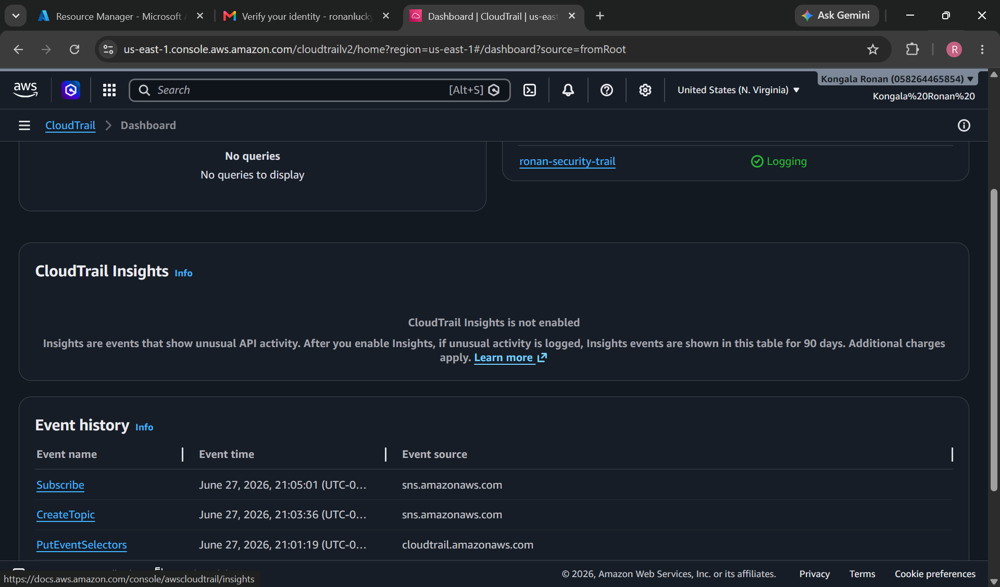

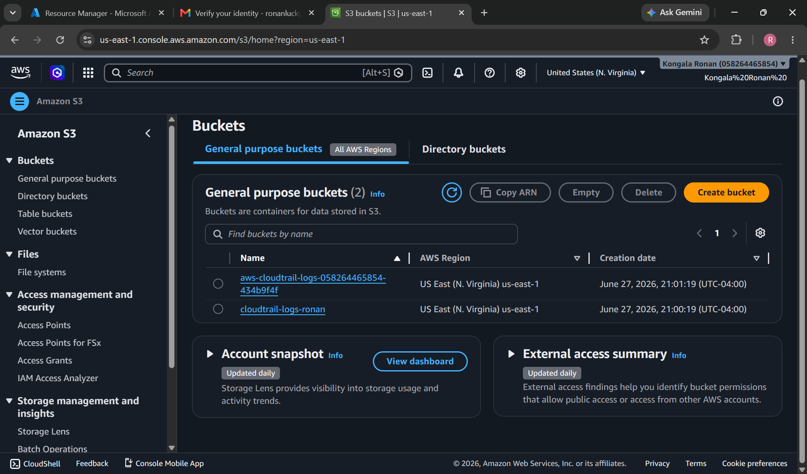

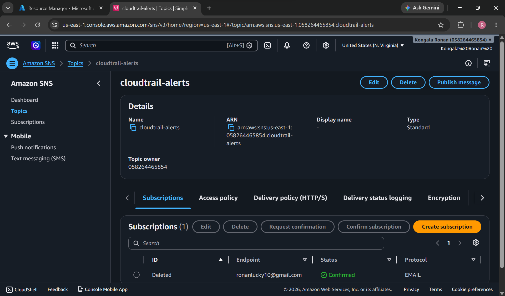

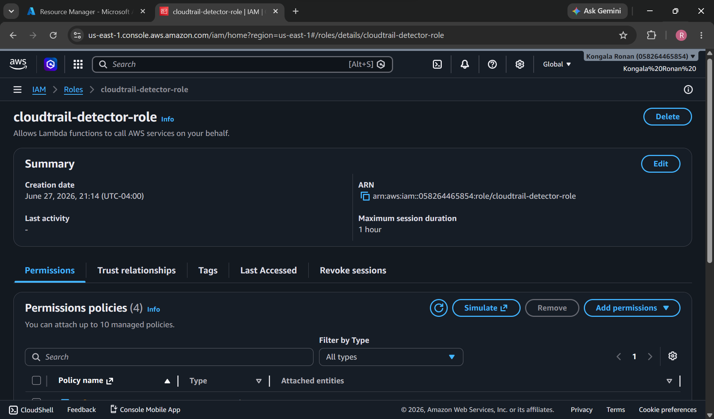

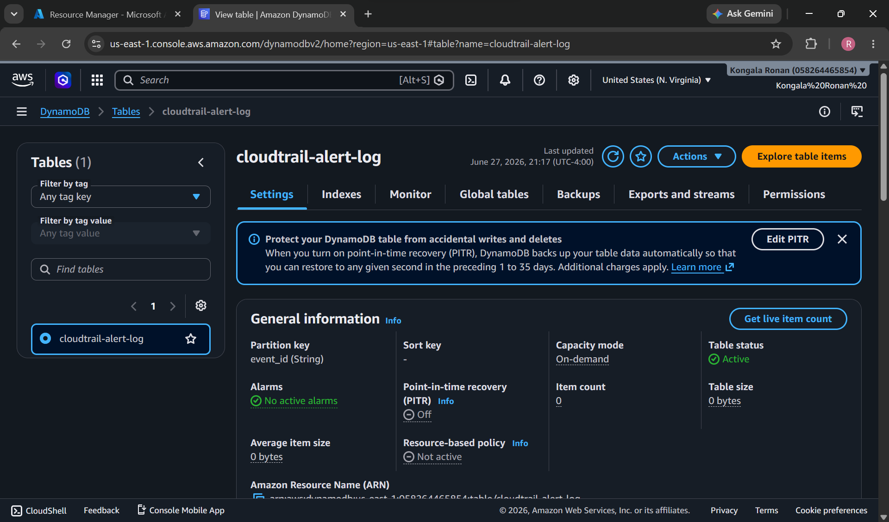

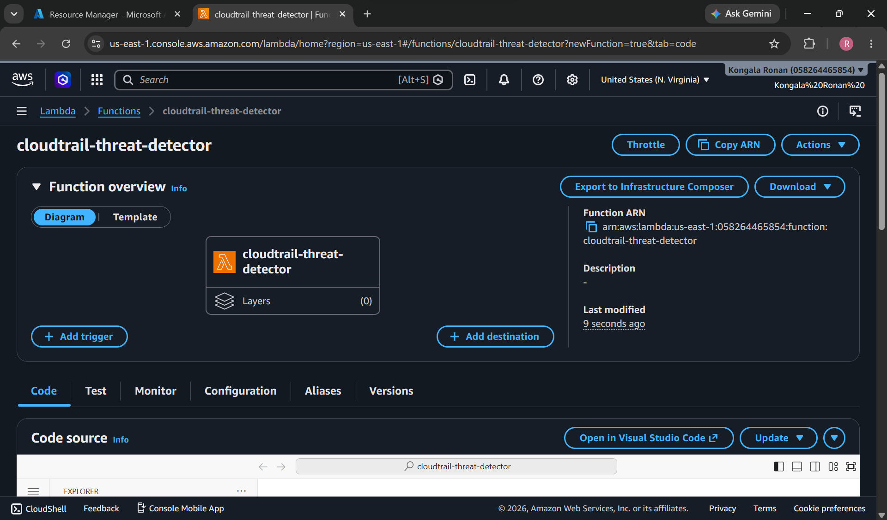

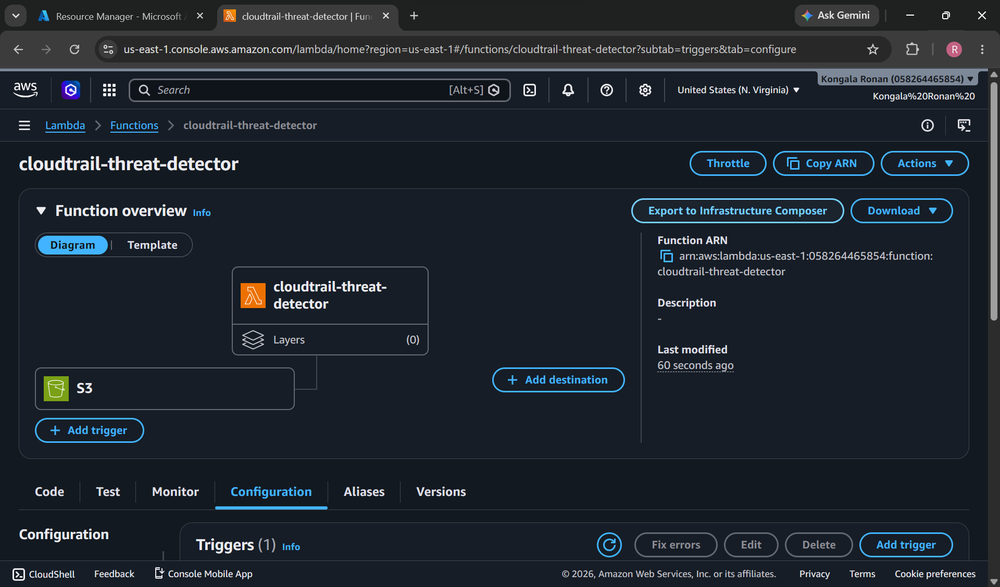

A `CreateUser` test producing the alert email, the matching DynamoDB record, and the Lambda invocations and log events in CloudWatch:

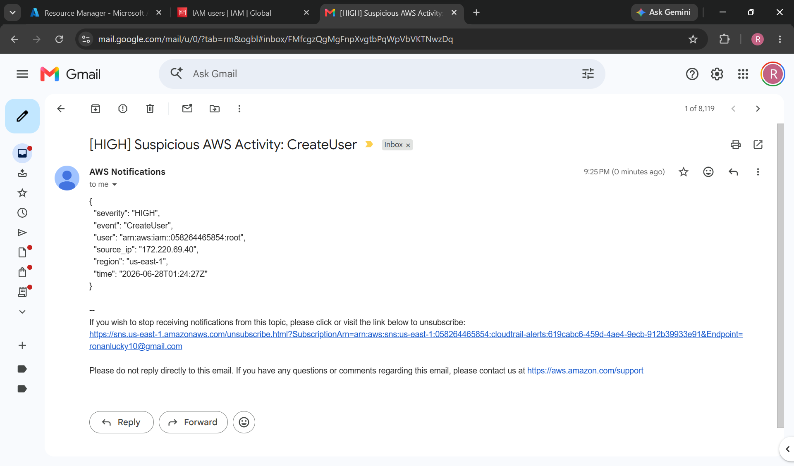

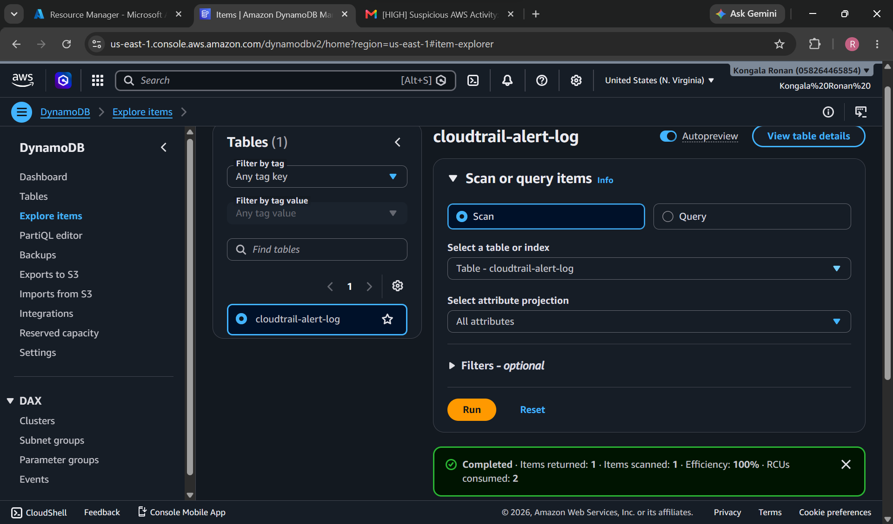

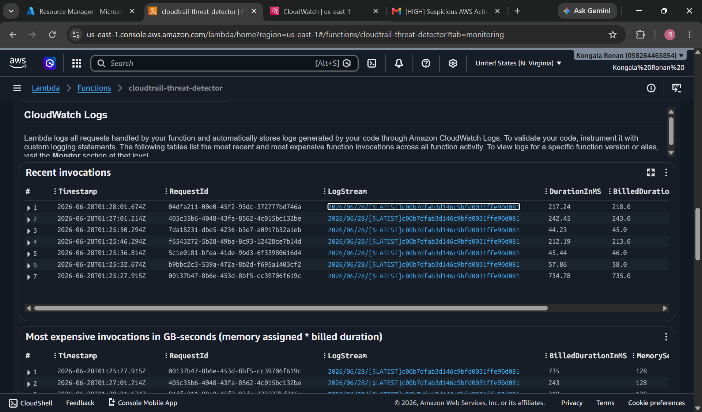

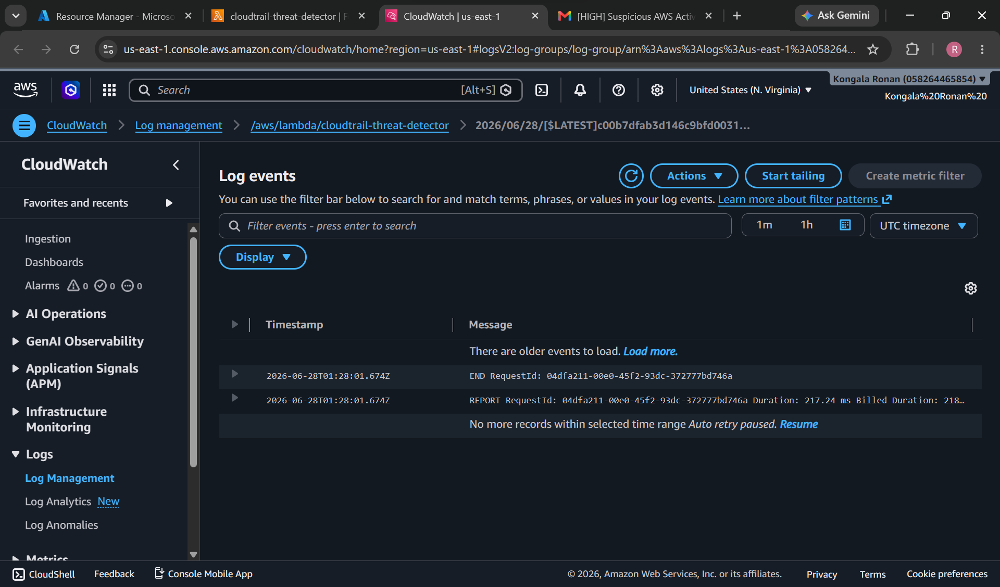

---

## Alert Schema

Each alert is sent via SNS email and logged to DynamoDB in the following format (account ID and IP redacted):

```json
{
  "severity": "HIGH",
  "event": "CreateUser",
  "user": "arn:aws:iam::123456789012:root",
  "source_ip": "203.0.113.10",
  "region": "us-east-1",
  "time": "2026-06-28T01:24:27Z"
}
```

---

## Setup Instructions

### Prerequisites
- AWS account (free tier sufficient)
- AWS Console access

### Step 1: Enable CloudTrail
- Create a multi-region trail logging to an S3 bucket
- Enable management events (Read + Write)

### Step 2: Create IAM Role
- Create role `cloudtrail-detector-role` for Lambda
- Attach: `AmazonS3ReadOnlyAccess`, `AmazonSNSFullAccess`, `AmazonDynamoDBFullAccess`, `CloudWatchLogsFullAccess`

These AWS managed policies get the lab running quickly but are broader than the function needs: the FullAccess policies grant every SNS, DynamoDB and CloudWatch Logs action on all resources. A least-privilege role would instead use an inline policy limited to `s3:GetObject` on the CloudTrail bucket, `sns:Publish` on the `cloudtrail-alerts` topic, `dynamodb:PutItem` on the `cloudtrail-alert-log` table, and `logs:CreateLogGroup`, `logs:CreateLogStream` and `logs:PutLogEvents` for the function's log group.

### Step 3: Create SNS Topic
- Create standard topic `cloudtrail-alerts`
- Add email subscription and confirm

### Step 4: Create DynamoDB Table
- Table name: `cloudtrail-alert-log`
- Partition key: `event_id` (String)

### Step 5: Deploy Lambda
- Runtime: Python 3.12
- Attach `cloudtrail-detector-role`
- Paste `lambda/detector.py` code
- Update `SNS_TOPIC_ARN` with your topic ARN
- Add S3 trigger on the CloudTrail log bucket

### Step 6: Test
Trigger detections by performing IAM actions (create user, attach policy) and verify:
- Email alert received via SNS
- Record written to DynamoDB
- Execution logged in CloudWatch

---

## Results

The 11 rules span all four severity levels (CRITICAL, HIGH, MEDIUM, LOW). In testing, CloudWatch recorded 6 Lambda invocations with a 100% success rate and 0 errors, and the test detections produced both an email alert and a DynamoDB record.
